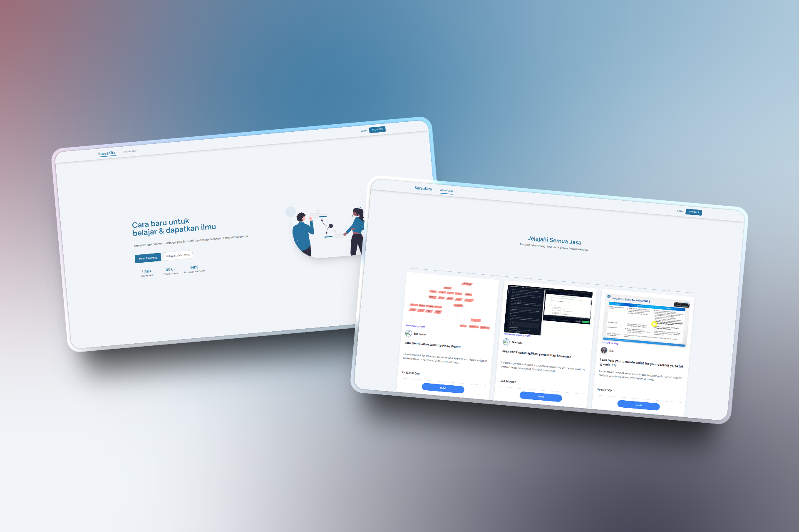

# KaryaKita - Marketplace Jasa Kreatif 🚀

KaryaKita adalah sebuah platform marketplace berbasis web yang dibangun menggunakan Laravel. Aplikasi ini bertujuan untuk menjadi jembatan antara para talenta kreatif di Indonesia (seperti fotografer, desainer, videografer) dengan para klien yang membutuhkan jasa mereka.

Proyek ini merupakan hasil akhir dari sebuah sesi mentorship intensif, dibangun dari nol hingga menjadi aplikasi full-stack yang fungsional.

 

---

## Fitur Utama ✨

Aplikasi ini memiliki tiga peran utama dengan alur fitur yang lengkap:

* **Untuk Publik & Klien:**
    * 🎨 **Homepage & Desain Modern:** Tampilan yang bersih dan profesional untuk memberikan kesan pertama yang kuat.
    * 🔍 **Jelajahi Jasa:** Halaman katalog untuk melihat semua jasa yang tersedia dengan pagination.
    * slug **URL SEO-Friendly:** Halaman detail jasa menggunakan `slug` untuk URL yang mudah dibaca.
    * 👤 **Registrasi & Login:** Sistem otentikasi untuk Klien dan Talent.
    * 🛒 **Sistem Booking:** Klien dapat memesan jasa dari halaman detail.
    * 📜 **Riwayat Booking:** Klien memiliki dashboard untuk melihat status semua booking yang mereka buat.
    * 💳 **Integrasi Pembayaran:** Alur pembayaran menggunakan **Midtrans (Sandbox)**, lengkap dengan notifikasi webhook untuk update status otomatis.

* **Untuk Talent:**
    * ⚙️ **Dashboard Produktif:** Halaman utama untuk melihat statistik dan mengelola bisnis.
    * 🖼️ **Manajemen Profil:** Talent dapat mengedit profil dan mengupload foto.
    * 📦 **Manajemen Jasa (CRUD):** Fungsionalitas penuh untuk menambah, melihat, mengedit, dan menghapus jasa yang ditawarkan, termasuk upload foto jasa.
    * 🔔 **Manajemen Booking:** Talent dapat melihat pesanan yang masuk dan memilih untuk **menerima** atau **menolaknya**.

* **Untuk Admin:**
    * 👑 **Admin Dashboard:** "Control Tower" terpisah dengan layout dan navigasi sendiri.
    * 👥 **Manajemen Pengguna:** Melihat daftar semua pengguna (Klien, Talent, Admin) dan dapat memblokir/mengaktifkan akun mereka.
    * 📊 **Manajemen Platform:** Melihat daftar semua jasa dan booking yang ada di seluruh platform.

---

## Teknologi yang Digunakan 🛠️

* **Backend:** Laravel 12
* **Frontend:** Blade, Tailwind CSS, Alpine.js
* **Database:** MySQL
* **Payment Gateway:** Midtrans (Sandbox)
* **Server Lokal:** Ngrok (untuk testing webhook)

---

## Cara Instalasi & Setup Lokal

1.  **Clone repository ini:**
    ```bash
    git clone [https://github.com/urboy-code/KaryaKita.git](https://github.com/urboy-code/KaryaKita.git)
    cd KaryaKita
    ```

2.  **Install dependensi:**
    ```bash
    composer install
    npm install
    ```

3.  **Setup environment:**
    ```bash
    cp .env.example .env
    php artisan key:generate
    ```

4.  **Konfigurasi file `.env`:**
    * Atur koneksi database (`DB_DATABASE`, `DB_USERNAME`, `DB_PASSWORD`).
    * Masukkan `MIDTRANS_SERVER_KEY` dan `MIDTRANS_CLIENT_KEY` Anda.

5.  **Jalankan migrasi dan seeder:**
    ```bash
    # Ini akan membuat semua tabel dan mengisi data awal (kategori, dll)
    php artisan migrate --seed
    ```

6.  **Buat storage link:**
    ```bash
    php artisan storage:link
    ```

7.  **Jalankan server:**
    * Di terminal pertama: `php artisan serve`
    * Di terminal kedua: `npm run dev`

Aplikasi sekarang bisa diakses di `http://127.0.0.1:8000`.

---

## Lisensi

Proyek ini berada di bawah Lisensi MIT.